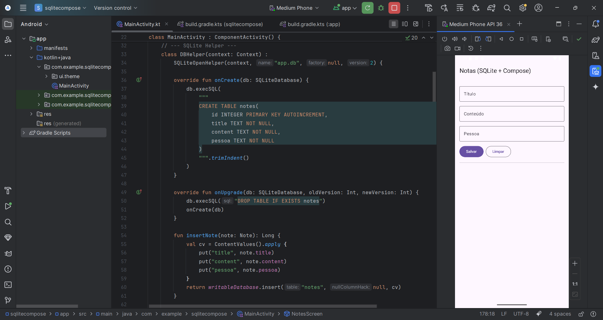

# 📝 Notes App - Kotlin (SQLite + Jetpack Compose)

Este projeto é um aplicativo de **notas** desenvolvido em **Kotlin**, utilizando **SQLite** como banco de dados local e **Jetpack Compose** para a interface.  
Com ele, é possível **criar, listar, editar e excluir notas** de maneira simples e intuitiva.

## 🚀 Funcionalidades
- Criar novas notas com:
  - **Título**
  - **Conteúdo**
  - **Pessoa responsável**
- Listar todas as notas armazenadas no banco.
- Editar notas existentes.
- Excluir notas do banco.
- Interface moderna com **Jetpack Compose**.

## 📷 Demonstração
Aqui está uma captura de tela da aplicação:  

